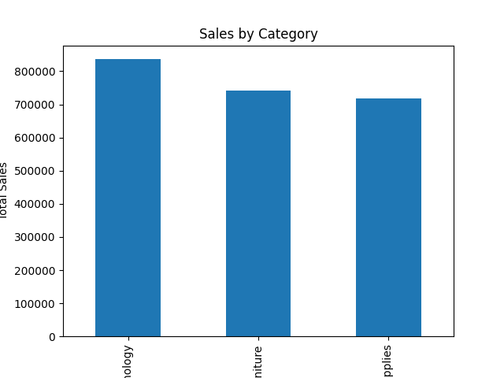
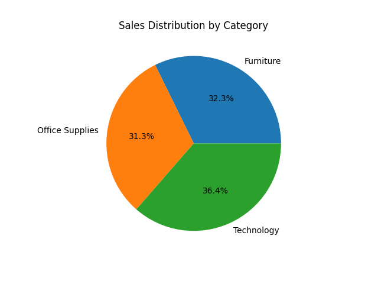
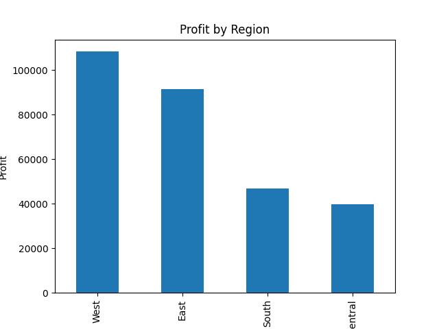
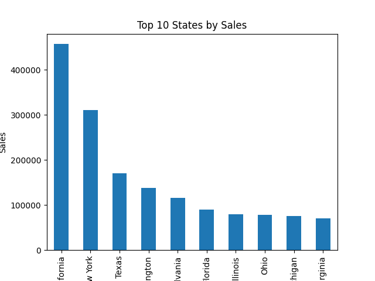
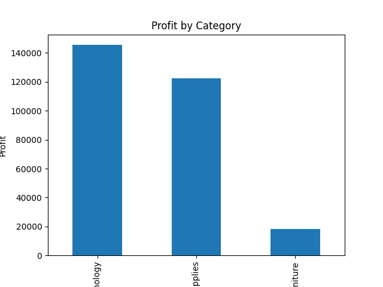

# 📊 Customer Analytics & Sales Forecasting

## Project Overview

This project analyzes retail sales data using Python. It performs data cleaning, exploratory data analysis (EDA), data visualization, and machine learning to generate business insights and predict sales.

##  Dataset

- Dataset Name: SampleSuperstore.csv
- Number of Records: 9,994
- Number of Columns: 13

##  Technologies Used

- Python
- Pandas
- Matplotlib
- Scikit-learn
- Joblib

##  Business Questions Answered

- Total Sales
- Total Profit
- Sales by Category
- Profit by Region
- Sales by State
- Top 10 States by Sales
- Sales by Sub-Category
- Average Sales by Region
- Sales by Customer Segment
- Most Used Ship Mode
- Profit by Category
- Top 10 Cities by Sales

##  Visualizations

The project includes the following charts:

- Sales by Category
- Sales Distribution by Category
- Profit by Region
- Top 10 States by Sales
- Top 10 Sub-Categories by Sales
- Average Sales by Region
- Sales by Customer Segment
- Ship Mode Analysis
- Profit by Category
- Top 10 Cities by Sales

All charts are automatically saved in the **images** folder.

##  Machine Learning

A Linear Regression model is used to predict sales.

### Features

- Quantity
- Discount
- Profit

### Target

- Sales

### Evaluation Metric

- Mean Absolute Error (MAE)

##  Project Structure

```text
Customer-Analytics-Project/
│
├── dashboard/
├── data/
├── images/
├── models/
├── notebooks/
├── src/
├── README.md
├── requirements.txt
└── .gitignore
```

##  Author

Greeshma

---

#  Project Visualizations

## 1. Sales by Category



---

## 2. Sales Distribution by Category



---

## 3. Profit by Region



---

## 4. Top 10 States by Sales



---

## 9. Profit by Category



